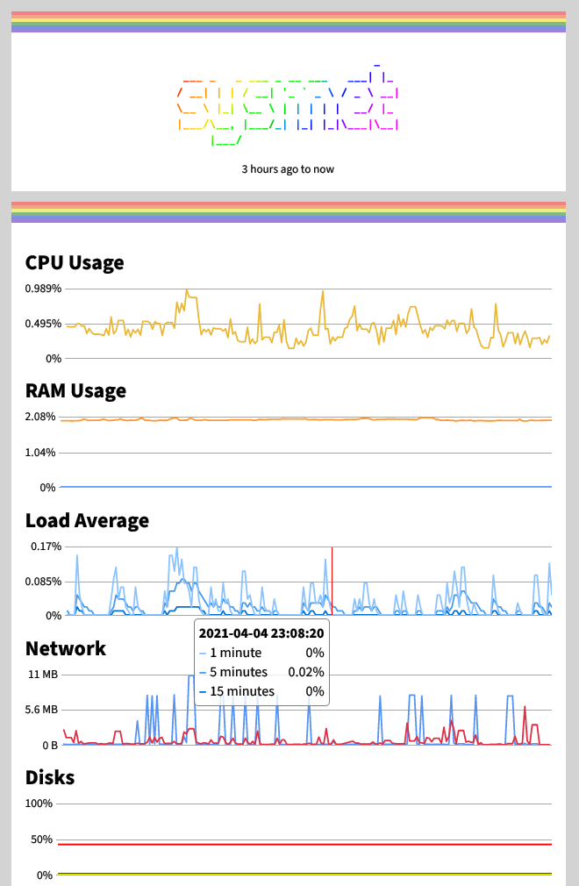

# [sysmet](https://unix.lgbt/~diamond/sysmet)

A no-JavaScript CGI-based lightweight system metrics collector and frontend,
effectively a very tiny version of the Grafana + Telegraf + InfluxDB stack.

## API Documentation

Refer to [pkg.go.dev][pkg.go.dev] as well as the [test suites][sysmet_test.go].

[pkg.go.dev]: https://pkg.go.dev/git.unix.lgbt/diamondburned/sysmet
[sysmet_test.go]: https://git.unix.lgbt/diamondburned/sysmet/src/branch/main/sysmet_test.go

## Note to Self

If I ever ponder about using BadgerDB over bbolt: don't, simply don't. Bbolt
allows concurrent read opens AND (!!!) waits until the exclusive writer is done
WITHOUT needing write permissions.
